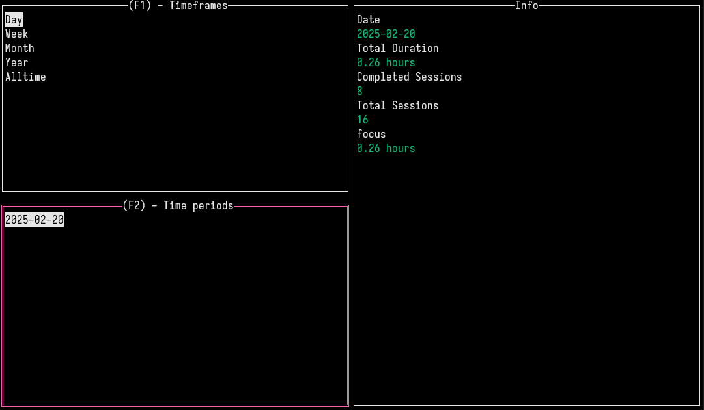

## pomogomo - a simple pomodoro CLI/TUI tool

Pomogomo provides history, statistics, and timers with UI.
Track time accumulated each day, week, or month doing tasks such as
studying, working, or reading, or create your own.

---

## Screenshots
1. Stats
    
2. Start
    

---

## Installation

Pomogomo can be installed by cloning the repo or via GO install.
Go is required. If you don't have Go, you can follow [official instructions](https://go.dev/doc/install) to install it.

* via cloning

```shell
git clone https://github.com/echo4eva/pomodomo.git
cd pomogomo/
go build
```

* via GO install
```shell
go install github.com/echo4eva/pomodomo@latest
```

---

## Commands/Usage

NOTE: If you installed via cloning, you must `cd` into the project directory
and use `./pomogomo <command>` to use the tool. If done through GO install,
you can just use `pomogomo <command>`.


```shell
# To start a pomodoro session
pomogomo start --minutes <number, defaults to 30> --task <task name, defaults to focus>
```

```shell
# To start a timer session
pomogomo start --minutes 0 --task <task name, defaults to focus>
```

```shell
# To view stats
pomogomo stats
```

```shell
# To view tasks
pomogomo task view
```

```shell
# To create custom task
pomogomo task create <task name>
```

```shell
# To delete task
pomogomo task delete <task name>
```

---

## Writeup

If you want to know my thoughts on making this tool, feel free to [read my blog on it](https://echo4eva.com/pomogomo/)!
